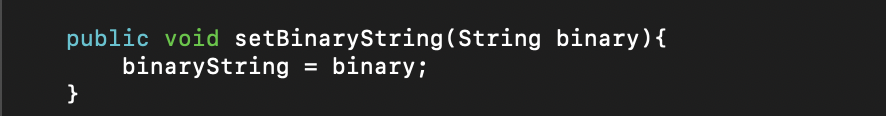
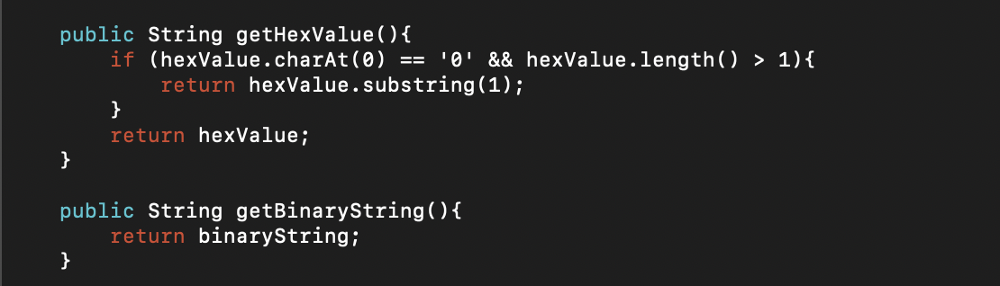

# Binary Converter <!-- omit in toc -->
### Table of Contents

- [Binary to Decimal Converter](#binary-to-decimal-converter)
  - [Constructors](#constructors)
  - [Getters and Setters](#getters-and-setters)
    - [Getters](#getters)
    - [Setters](#setters)
  - [Convert Function](#convert-function)
- [Binary to Hexadecimal Converter](#binary-to-hexadecimal-converter)
  - [Hexadecimal Converter Constructor](#hexadecimal-converter-constructor)
  - [Getters and Setters](#getters-and-setters-1)
    - [Getters](#getters-1)
    - [Setters](#setters-1)
  - [Converter](#converter)
    - [Correct Binary String Length](#correct-binary-string-length)
    - [Convert Byte to Hex](#convert-byte-to-hex)
    - [Convert](#convert)
- [Compilation and Building](#compilation-and-building)
  - [Compilation](#compilation)
  - [Building](#building)
- [Running](#running)

# Binary to Decimal Converter
## Constructors


- The default `Decimal()` constructor automatically sets the binary number to be converted to `"0000"`.
- The `Decimal(String binaryString)` constructor sets the binary number to be converted to the parameter's value.
**Both constructors set the** `decimalValue`  **variable to 0**

## Getters and Setters

### Getters

- The `getDecimalValue()` function returns the value of the binary number as a Decimal number if the `convert()`<sup>[1](#convert-function)</sup> function has been called. It otherwise will return 0.

- The `getBinaryValue()` function returns the value of the binary number as it is, without any conversions.

### Setters

- The `setBinaryString()` function allows the programmer to set what the binary number is after the constructer has been called.

## Convert Function 

- The `convert()` function converts the binary number to a decimal. It does such by using a `for` loop.

# Binary to Hexadecimal Converter
## Hexadecimal Converter Constructor


- The default `Hexadecimal()` constructor automatically sets the binary and hexadecimal values to `"0000"` and `"0"` respectively. 
- The `Hexadecimal(String binary)` constructor sets the binary value to the parameter value and the hexadecimal value to an empty string.

## Getters and Setters
### Getters

- The  `getHexValue()` function will return the value of the converted number.
  - If the converter is first created with the default constructor, it will have a leading `0` when converting. The `if` statement just checks to see if the Hex value starts with a `0`, and if it does, it will return the hex value without the `0` unless the Hex value is only `0`.
    - **Note: The Converter will have an output length based on the number of bytes inputed (e.g. 000101 will output 2 Hex values [05]).**
- For the `getBinaryString()` function, refer to the Decimal's `getBinaryString()`<sup>[2](#getters)</sup>

### Setters

- The `setBinaryString(String binary)` function sets the value of the `binaryString` to the parameter `binary`'s value

## Converter
### Correct Binary String Length

- The `correctLength()` function checks to see if the length of `binaryString` is a multiple of 4. If it isn't leading `0` are added until the length of `binaryString` is a multiple of 4.

### Convert Byte to Hex

- The `convertToHex(String byte_)` function converts 4 bits, then converts the bits to the corresponding hexadecimal value.

### Convert

- The `convert()` function first calls the `correctLength()`<sup>[3](#correct-binary-string-length)</sup> function, then takes 4 characters of `binaryString` to convert to a hexadecimal value using the `convertToHex()`<sup>[4](#convert-byte-to-hex)</sup> function.


# Compilation and Building
## Compilation
To compile the source code, you need to run the following command:
```bash
$ javac src/assignment/Main.java src/assignment/conversion/*.java
```

## Building
To build the JAR executable, run the following commands:
```bash
$ cd src
$ jar -cvfe ../BinaryConverter.jar assignment.Main assignment/Main.class assignment/conversion/*.class
```
# Running
To run the JAR, run the following commands:
```bash
$ cd ..
$ java -jar BinaryConverter.jar
```